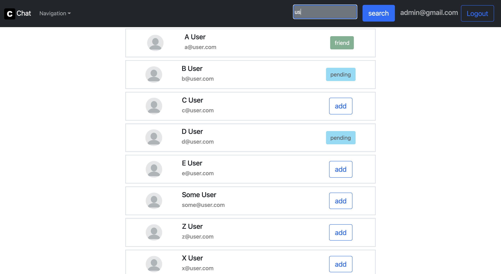

# chat

##APP FUNCTIONALITIES:

-   Singup / signin (with custom (but simple) id generating on signup)
-   Ability to edit users data such as email, firstname and lastname
-   Adding users to friends list and removing them ( you can send request and wait for someone to accept or reject it)
-   Searching users from whole app
-   Sending messages to users on your friends list (real time)

## Tech/framework used 🔧

| Tech                                           | Description                               |
| ---------------------------------------------- | ----------------------------------------- |
| [Typescript](https://www.typescriptlang.org/)  | Javascript superset language              |
| [React](https://reactjs.org/)                  | Library for building user interfaces      |
| [Express](https://expressjs.com/)              | Backend web framework for Node.js         |
| [Jwt](https://jwt.io/)                         | Library for identifying user session      |
| [MongoDB](https://www.mongodb.com/)            | Non-relational database                   |
| [Eslint](https://eslint.org/)                  | Javascript Linter                         |
| [Prettier](https://prettier.io/)               | Code formatter                            |
| [Lerna](https://lerna.js.org/)                 | Tool for monorepo projects                |
| [Bcrypt](https://www.npmjs.com/package/bcrypt) | Package for crypting (hashing) data       |
| [Bootstrap](https://getbootstrap.com/)         | CSS library                               |
| [Axios](https://axios-http.com/docs/intro)     | Promise based HTTP client                 |
| [Socket.io](https://socket.io/)                | Library for real-time communication (ws)  |
| [Redis](https://redis.io/)                     | In-memory data structure store (for chat) |

## Photos 📷

### Live chatting with anyone on your friend list (chat data stored in redis)

### Editing and checking users profile data

### Managin your friend list

### Searching and sending requests to users

